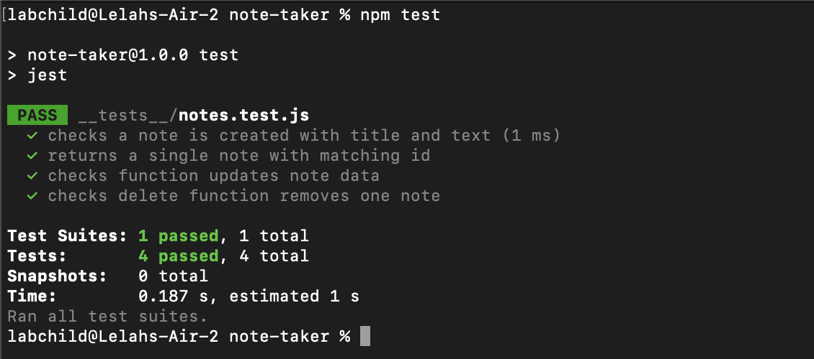

# Note Taker
Take notes with express!


## Description

### Table of Contents
* [Installation](#installation)
* [Usage](#usage)
* [License](#license)
* [Tests](#tests)
* [Questions & Contact](#questions&contact)
* [Acknowledgements](#acknowledgements❣️)

## Installation
You can access the deployed version of this site [here](https://nameless-crag-18820.herokuapp.com/).

To run this project on your local machine, download or clone this repositiory. Next, navigate to the project's root directory from the command line. Run the following command:
``` 
npm i 
```
Once installed, start the express server by running the following command:
```
npm start
```
You can now visit the page in your web browser at http://localhost:3001. To stop the server running at any time, press ```Ctrl C``` (```^C``` on macOS).

## Usage
To use the live site, click [here](https://nameless-crag-18820.herokuapp.com/) to visit the deployed application.

## Contributing
This project uses the following packages:
* [Jest](https://jestjs.io/) testing framework
* [Express](https://expressjs.com/) web application framework
* Deployed with [Heoku](https://www.heroku.com/)

The frontend was provided in the curricullum for Columbia University's Full-Stack Bootcamp.

## License

This is an open source project and falls under the [MIT license](./LICENSE.md).

## Tests
This project follows TDD practices. It uses Jest and includes a test suite for note functions and methods.


## Questions & Contact
Backend code written and deployed by Lelah Bates Childs.

You can find me on GitHub [@labchild](https://github.com/labchild) or [email me](mailto:labchilds@gmail.com). If you have any questions about this project, please reach out. If you encounter any bugs or other problems, [submit an issue](https://github.com/labchild/team-profile-generator/issues).

### Want to Help?
Do you see something I missed or a more succint and effective way this code can be written? Great! Please reach out and let me know how I can improve. Thanks in advance for your tips, tricks, and pointers!

## Acknowledgements ❣️
Thank you to my bootcamp instructional team and cohort, for helping me along this journey to become a developer.