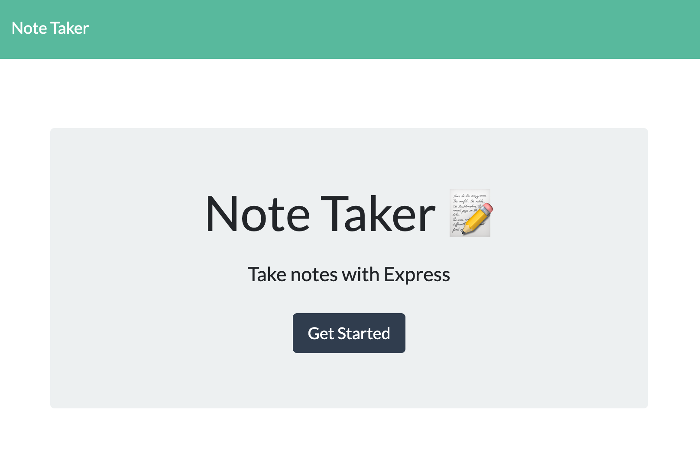
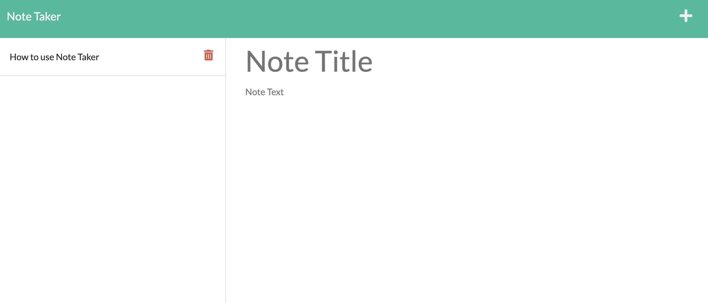
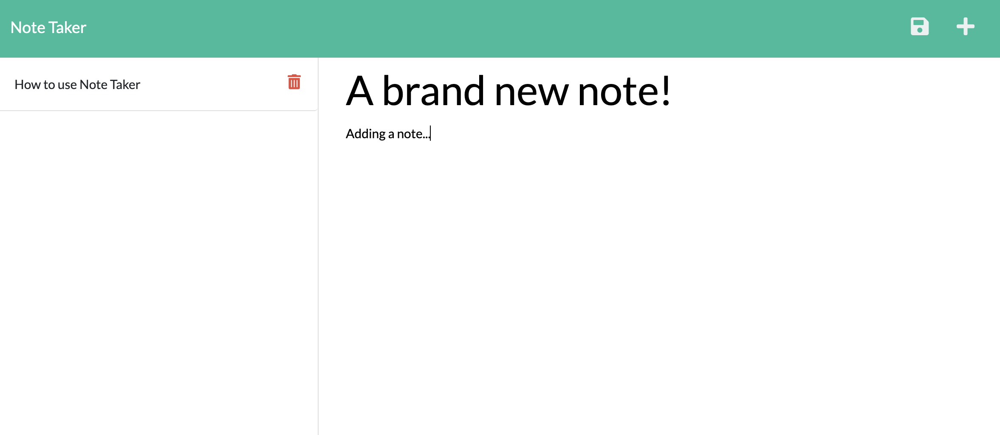

# Note Taker
  
Take notes with express!

### Table of Contents
* [Description](#description)
* [Installation](#installation)
* [Usage](#usage)
* [Contributing](#contributing)
* [License](#license)
* [Tests](#tests)
* [Questions & Contact](#questions&contact)
* [Acknowledgements](#acknowledgements❣️)

## Description
Note Taker is a simple note taking web application that allows the user to write and save notes to a dataset for future reference. Users can also delete existing notes from the dataset.

## Installation
You can access the deployed version of this site [here](https://nameless-crag-18820.herokuapp.com/).

To run this project on your local machine, download or clone this repositiory. Next, navigate to the project's root directory from the command line. Run the following command:
``` 
npm i 
```
Once installed, start the express server by running the following command:
```
npm start
```
You can now visit the page in your web browser at http://localhost:3001. To stop the server running at any time, press ```Ctrl C``` (```^C``` on macOS).

## Usage
To use the live site, click [here](https://nameless-crag-18820.herokuapp.com/) to visit the deployed application.


From click the 'Get Started' button to begin taking notes. You will be brought to the 'Notes' page.


Click on the 'Add Note' button (plus sign) in the top-right corner of the winow to add a new note. When you're done, click the 'Save' button (floppy disk icon) in the top-right corner of the window.


To view or delete existing notes, find the title of the note in the list on the left side of the window. Click on the title to display the note and its details. Click the 'Delete' button (red trash can icon) to remove the note from the list.

## Contributing
This project uses the following packages:
* [Jest](https://jestjs.io/) testing framework
* [Express](https://expressjs.com/) web application framework
* Deployed with [Heoku](https://www.heroku.com/)

The frontend was provided in the curricullum for Columbia University's Full-Stack Bootcamp.

## License

This is an open source project and falls under the [MIT license](./LICENSE.md).

## Tests
This project follows TDD practices. It uses Jest and includes a test suite for note functions and methods.


## Questions & Contact
Backend code written and deployed by Lelah Bates Childs.

You can find me on GitHub [@labchild](https://github.com/labchild) or [email me](mailto:labchilds@gmail.com). If you have any questions about this project, please reach out. If you encounter any bugs or other problems, [submit an issue](https://github.com/labchild/team-profile-generator/issues).

### Want to Help?
Do you see something I missed or a more succint and effective way this code can be written? Great! Please reach out and let me know how I can improve. Thanks in advance for your tips, tricks, and pointers!

## Acknowledgements ❣️
Thank you to my bootcamp instructional team and cohort, for helping me along this journey to become a developer.
